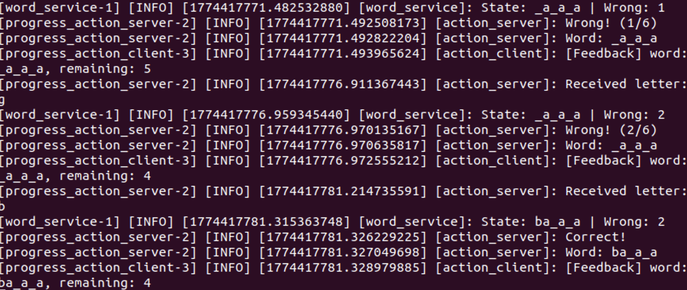
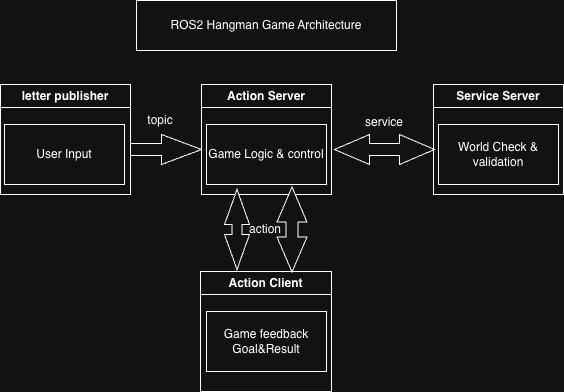

# ROS2 Hangman Game 🎮

## 📌 Overview
ROS2 기반의 행맨 게임 프로젝트입니다.  
Action, Service, Topic을 활용하여 **비동기 분산 시스템 구조**를 구현했습니다.

이 프로젝트는 단순 게임 구현이 아니라,  
👉 **ROS2의 핵심 통신 구조(Action / Service / Topic)를 실제로 통합 설계 및 구현**하는 데 목적이 있습니다.

---

## 🧠 Architecture

- **Action Server**: 게임 전체 흐름 관리 (상태, 종료 조건)
- **Service (WordService)**: 입력된 알파벳의 정답 여부 판단 및 상태 업데이트
- **Topic (input_letter)**: 사용자 입력 처리

👉 The system combines:
- **Action** for long-running processes (game loop)
- **Service** for request-response logic (letter validation)
- **Topic** for asynchronous input streaming

---

## 🔄 System Flow

1. Action Client sends a goal to start the game
2. Action Server enters a loop waiting for user input (Topic)
3. User input is received asynchronously
4. Action Server sends a request to WordService
5. WordService updates the game state and returns the result
6. Action Server publishes feedback to the client
7. The loop continues until a win or loss condition is met
8. Final result is returned to the client

---

## ⚙️ Tech Stack

- ROS2 Humble
- Python (rclpy)
- DDS 기반 통신 구조

---
## 📸 Demo

<p align="center">
  
</p>

---

## 🏗 Architecture
<p align="center">
  
</p>

### 🔧 Design Rationale
- **Topic (input_letter)**: 사용자 입력은 비동기 스트림이므로 Topic으로 처리
- **Service (WordService)**: 알파벳 검증은 즉각적인 응답이 필요하므로 Service 사용
- **Action Server**: 게임은 장시간 상태를 유지하므로 Action으로 관리
---

## 🚀 How to Run

### 1️⃣ Build the workspace

```bash
cd ~/hangman_ws
colcon build --symlink-install
source install/setup.bash
```

### 2️⃣ Run
```bash
ros2 launch hangman_game hangman.launch.py
```
